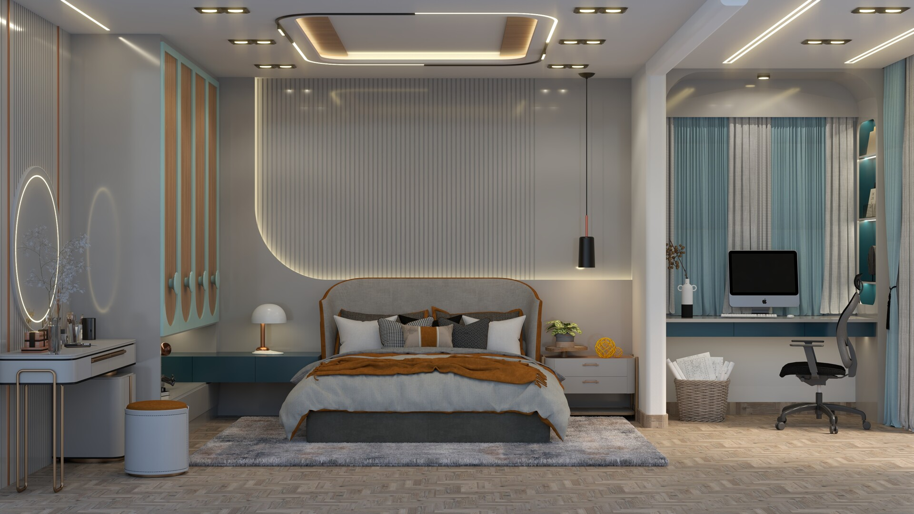

# vizion3d

**vizion3d** is an open-source Python library for 3D computer vision that gives ML/CV researchers a single, unified interface for running inference across the full spectrum of 3D vision tasks — from depth estimation and point cloud generation to NeRF reconstruction and pose estimation.

Every task is accessible through three consumption modes driven by one shared CQRS architecture:

| Mode | When to use |
|---|---|
| **Direct Python import** | Notebooks, research scripts, local prototyping |
| **REST API** | Web integrations, any-language clients |
| **gRPC API** | High-throughput, low-latency microservice pipelines |

Point-cloud inputs and outputs use OpenGL/viewer camera space throughout vizion3d:

```text
X+ = right
Y+ = up
Z- = forward into the scene
```

---

<a id="sample-output"></a>

<figure>
  
  <figcaption style="color:#aaa;font-size:0.8em;margin-top:0.3rem;">input image</figcaption>
</figure>

<figure>
  
  <figcaption style="color:#aaa;font-size:0.8em;margin-top:0.3rem;">depth map</figcaption>
</figure>

<figure>
  <div id="ply-viewer" style="width:105%;margin-left:-3.5%;margin-right:-3.5%;height:480px;overflow:hidden;border-radius:6px;background:#d8d8d8;"></div>
  <figcaption style="color:#aaa;font-size:0.8em;margin-top:0.3rem;">Generated Point cloud from depth estimation</figcaption>
</figure>

<script type="importmap">
{
  "imports": {
    "three": "https://cdn.jsdelivr.net/npm/three@0.160.0/build/three.module.js",
    "three/addons/": "https://cdn.jsdelivr.net/npm/three@0.160.0/examples/jsm/"
  }
}
</script>

<script type="module">
import * as THREE from 'three';
import { PLYLoader } from 'three/addons/loaders/PLYLoader.js';
import { TrackballControls } from 'three/addons/controls/TrackballControls.js';

const container = document.getElementById('ply-viewer');
const renderer = new THREE.WebGLRenderer({ antialias: true, alpha: true });
renderer.setPixelRatio(window.devicePixelRatio);

// Set canvas to fill the container via CSS; Three.js buffer stays in sync via ResizeObserver.
renderer.setSize(container.clientWidth || 800, container.clientHeight || 480, false);
renderer.domElement.style.cssText = 'width:100%;height:100%;display:block;';
container.appendChild(renderer.domElement);

const scene = new THREE.Scene();
const camera = new THREE.PerspectiveCamera(60, (container.clientWidth || 800) / (container.clientHeight || 480), 0.001, 1000);
const controls = new TrackballControls(camera, renderer.domElement);
controls.rotateSpeed = 1.0;
controls.dynamicDampingFactor = 0.2;

new ResizeObserver(() => {
  const w = renderer.domElement.clientWidth;
  const h = renderer.domElement.clientHeight;
  if (w > 0 && h > 0) {
    renderer.setSize(w, h, false);
    camera.aspect = w / h;
    camera.updateProjectionMatrix();
  }
}).observe(renderer.domElement);

new PLYLoader().load('assets/pointclouds/roomhd_result.ply', (geometry) => {
  const material = new THREE.PointsMaterial({ size: 0.003, vertexColors: true });
  const points = new THREE.Points(geometry, material);
  scene.add(points);
  geometry.computeBoundingBox();
  const center = new THREE.Vector3();
  geometry.boundingBox.getCenter(center);
  points.position.sub(center);
  const size = geometry.boundingBox.getSize(new THREE.Vector3()).length();
  camera.position.set(0, size * 0.3, size * 0.6);
  camera.far = size * 10;
  camera.updateProjectionMatrix();
  controls.target.set(0, 0, 0);
  controls.maxDistance = size * 5;
  controls.update();
});

(function animate() {
  requestAnimationFrame(animate);
  controls.update();
  renderer.render(scene, camera);
})();
</script>

---

## Installation

Requires **Python 3.12** (Open3D constraint).

PyTorch is **not bundled** in the base install — choose the extra that matches your hardware (see [Hardware Acceleration](hardware_acceleration.md)). For CPU and Apple Silicon MPS, the extra installs PyTorch automatically. For NVIDIA CUDA and AMD ROCm, the matching PyTorch wheel must be installed first from PyTorch's own index — see the [Hardware Acceleration](hardware_acceleration.md) page for pinned install commands.

**pip**
```bash 
pip install "vizion3d[cpu]"
```

**Poetry**
```bash
poetry add "vizion3d[cpu]"
```

**uv**
```bash
uv python pin 3.12
uv add "vizion3d[cpu]"
```

---

## Hardware acceleration

vizion3d detects the best available backend automatically at runtime — no code changes required. Supported backends are CPU, NVIDIA CUDA, Apple Silicon MPS, and AMD ROCm.

For per-backend prerequisites, install commands, and platform notes, see the [Hardware Acceleration](hardware_acceleration.md) page.

---

## Quick start — depth estimation

Get a depth map and point cloud from a single image in under 10 lines.

```python
import open3d as o3d
from vizion3d.lifting import DepthEstimation, DepthEstimationCommand

result = DepthEstimation().run(
    DepthEstimationCommand(
        image_input="roomhd.jpg",
        return_point_cloud=True,
    )
)

print(f"Depth range : {result.min_depth:.4f} → {result.max_depth:.4f}")
print(f"Points      : {len(result.point_cloud.points)}")
print(f"Scale       : {result.point_cloud_scale} metre per unit")

o3d.io.write_point_cloud("roomhd_result.ply", result.point_cloud)
```

The generated point cloud uses OpenGL/viewer camera space: `X+` right, `Y+` up, `Z-` forward.

<span style="color:#aaa;font-size:0.85em;">Output: [roomhd.jpg and roomhd_result.ply](#sample-output)</span>

---

## Starting the servers

**pip / Poetry**
```bash
# REST API (FastAPI, default port 8000)
vizion3d-serve-rest

# gRPC API (default port 50051)
vizion3d-serve-grpc
```

**uv**
```bash
# REST API (FastAPI, default port 8000)
uv run vizion3d-serve-rest

# gRPC API (default port 50051)
uv run vizion3d-serve-grpc
```

---

## Architecture

vizion3d uses a [CQRS](https://martinfowler.com/bliki/CQRS.html) pattern throughout:

- **Commands** carry inference parameters and trigger side-effecting handlers.
- **Queries** retrieve results or metadata without side effects.
- All handlers are registered through a [`clean_ioc`](https://github.com/peter-daly/clean-ioc) container — no direct handler instantiation anywhere in the public API.

Each task lives in its own module under `vizion3d/<category>/` and exposes exactly `commands.py`, `handlers.py`, and `models.py`. Adding a new task means adding one module and one container registration — nothing else changes.

---

## Tasks

### Lifting (2D → 3D)

| Task | Status | Docs |
|---|---|---|
| Monocular depth estimation | Stable | [Depth Estimation](features/depth_estimation.md) |
| Stereo depth estimation | Stable | [Stereo Depth](features/stereo_depth.md) |

### Annotation

| Task | Status | Docs |
|---|---|---|
| Object mask annotation 3D | Stable | [Object Mask Annotation 3D](annotation/object_mask_annotation_3d.md) |

---

## Quick start — object mask annotation 3D

Detect and instance-segment objects in a scene, then get the exact 3D point cloud subset for each detected object.

```python
import open3d as o3d
from vizion3d.annotation import ObjectMaskAnnotation3D, ObjectMaskAnnotation3DCommand

pcd = o3d.io.read_point_cloud("scene.ply")

result = ObjectMaskAnnotation3D().run(
    ObjectMaskAnnotation3DCommand(
        point_cloud=pcd,
        image_input="scene.jpg",   # optional — omit to synthesise from the cloud
        return_annotated_cloud=True,
    )
)

for ann in result.annotations:
    print(f"{ann.label:20s}  conf={ann.confidence:.2f}  3D points={len(ann.point_indices)}")

o3d.io.write_point_cloud("annotated.ply", result.annotated_cloud)
```

See [Object Mask Annotation 3D](annotation/object_mask_annotation_3d.md) for the full reference.
